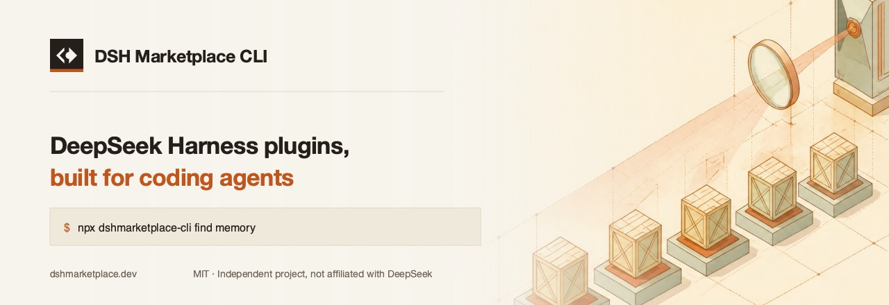

<p align="center">
  
</p>

<p align="center">
  <a href="https://www.npmjs.com/package/dshmarketplace-cli"></a>
  <a href="https://www.npmjs.com/package/dshmarketplace-cli"></a>
  <a href="#"></a>
  <a href="LICENSE"></a>
  <a href="https://linux.do"></a>
</p>

<p align="center">
  <a href="README.md">English</a> · <b>简体中文</b>
</p>

---

在命令行里查找和安装 **DeepSeek Harness（DSH）插件**。

```bash
npx dshmarketplace-cli find memory
npx dshmarketplace-cli add Anionex/dsh-vision-toolkit
```

不用全局安装，零依赖，不用注册。

## 这东西解决什么问题

[DeepSeek Harness](https://github.com/deepseek-ai/deepseek-harness) 是 DeepSeek
开源的 agent harness，所有能力都是插件。社区插件已经上千个，散在
`dsh-plugin` topic 和社区精选库里——找到对的那个，比装上它难多了。

这个 CLI 搜的是 [dshmarketplace.dev](https://dshmarketplace.dev) 的目录，在你
运行之前告诉你这个插件会碰到什么，然后把正确的安装命令交给 `dsh`：能走 npm
tarball 就走 npm，否则用锁定的 GitHub 源。

## 命令

### `find <关键词>`

搜能力，别搜产品名。

```bash
npx dshmarketplace-cli find memory
npx dshmarketplace-cli find vision --limit 5
npx dshmarketplace-cli find terminal --category ui
```

### `info <owner/repo>`

单个插件的分类、语言、开源协议、源码地址、识别到的风险标记，以及所有安装方式。

```bash
npx dshmarketplace-cli info Anionex/dsh-vision-toolkit
```

### `add <owner/repo>`

解析插件并通过 `dsh` 执行安装。

```bash
npx dshmarketplace-cli add NanmiCoder/dsh-agent-teams
npx dshmarketplace-cli add liustack/modlens --dry-run
npx dshmarketplace-cli add some/plugin --profile tui
```

| 选项 | 作用 |
| --- | --- |
| `--limit <n>` | 显示多少条（`find`，默认 10） |
| `--category <id>` | 按分类过滤（`find`） |
| `--source github` | 强制用 GitHub 源而不是 npm（`add`） |
| `--profile <name>` | 装进哪个 DSH profile（`add`，默认 `web`） |
| `--dry-run` | 只打印命令，不执行（`add`） |
| `--json` | 机器可读输出，结构稳定（所有命令） |

## 给 coding agent 用

所有命令都支持 `--json`，输出 `{ ok, command, version, ... }`。「只解析不执行」
是一等公民：

```bash
npx dshmarketplace-cli add <owner/repo> --dry-run --json
```

返回里带着确切会执行的命令、源码仓库地址，以及识别到的风险标记——要不要真的
运行，决定权留给调用方。包里还带了一份 `SKILL.md`，会读 skill 的 agent 会自动
路由过来，而不是凭训练记忆猜一个插件名——这个生态才几天，猜错比猜对容易。

## 环境要求

Node 18 以上，以及 PATH 里能找到 DeepSeek Harness：

```bash
npx @deepseek-ai/dsh web
```

## 安全

插件是第三方代码，跑起来带的是你 agent 的权限。**被这个目录收录不代表通过了
安全审计。**

凡是能自动识别的，记录里都会标出安装脚本、终端执行、需要密钥，`add` 在真正
运行之前会先打印出来。源码地址始终会显示——装之前读一眼。

有两种失败不是你的操作问题：

- **`--profile` 是必填的。** `dsh plugin` 是转发给 profile 目录里的 pnpm，
  不带这个参数 `dsh` 会直接退出，什么都不装。这个 CLI 打印出来的命令已经带上了。
- **GitHub 源需要放行构建脚本。** pnpm 默认不让 git 来源的包跑构建脚本，要把
  它打印的 key 加到 profile 的 `pnpm-workspace.yaml` 的 `allowBuilds` 下面。
  发布到 npm 的插件不需要这一步，所以 npm 排在前面。

## 配置

| 变量 | 用途 |
| --- | --- |
| `DSHM_API` | 把 CLI 指向另一个目录端点 |

## 相关链接

- 目录 —— <https://dshmarketplace.dev>
- DSH 内嵌插件 —— [`dshmarketplace-plugin`](https://github.com/DshMarketPlace/dsh-plugins-store)
- DeepSeek Harness —— <https://github.com/deepseek-ai/deepseek-harness>
- `dsh-plugin` topic —— <https://github.com/topics/dsh-plugin>

## 联系

- **社区** —— [LINUX DO](https://linux.do)
- **问题反馈** —— [GitHub Issues](https://github.com/DshMarketPlace/dshmarketplace-cli/issues)

## 致谢

- [**LINUX DO**](https://linux.do) —— DSH 生态实际上是在这里被讨论的，这个
  项目也在这里发布和收反馈。作者本人在 LINUX DO 发过帖的插件，在目录里会带
  一个认证标记。
- [awesome-dsh-plugin](https://github.com/awesome-dsh-plugin/awesome-dsh-plugin)
  （CC0-1.0）—— 目录的收录种子来自这里。

## 开源协议

MIT。独立项目，与 DeepSeek 官方无隶属关系。DeepSeek 与 DeepSeek Harness 是
各自权利人的标识，此处仅用于说明这些插件是做什么用的。
